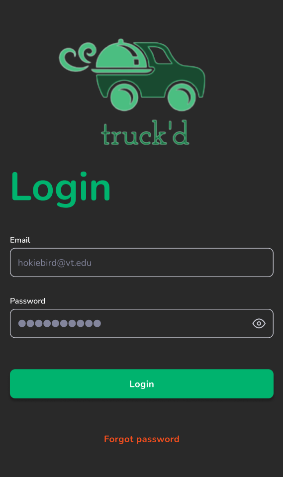
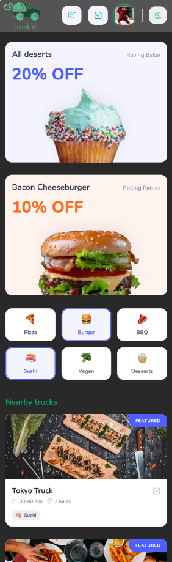

# truck'd
 truck'd is a food truck ordering and tracking application. This app allows the users to find and place orders at there favorite food trucks. It also provides
 a social media aspect where users can share their orders, post reviews and photos, and engage with each others posts. 
 
 Designed for CS3704 - Intermediate Software Design
   by Group 16:
 * Sami Marzougui
 * Juan Jovel
 * Fritz Silva
 * Vignesh Sinha
 * Maxwell Tran

# Screenshots

